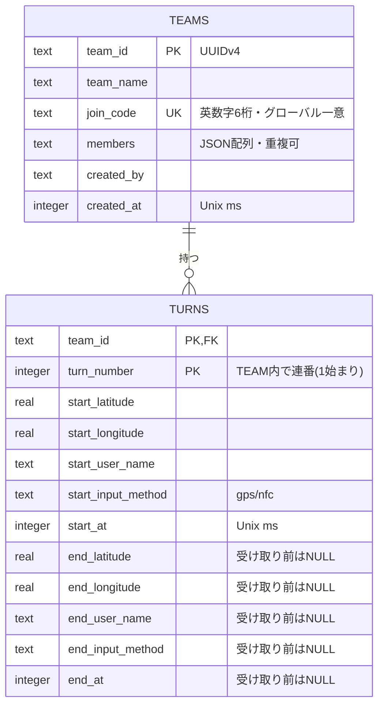

# NFC版デジタルリレー｜簡易設計書

> 無料版はGPSの緯度・経度で利用でき、NFCは企業・商業施設向けの追加入力手段とする。参加者はチームを作成・参加して遊ぶ。バックエンドはCloudflare（Workers + D1）で構築する。
>
> インフラ構成・運用の詳細は [infra_design.md](./infra_design.md)、設計レビューの記録は [design_review.md](./design_review.md) を参照。

## 1. 目的

NFCを現実との接続点として使い、実際の場所への移動とバトンの受け渡しをつなげる。

基本機能はNFCなしでも使えるようにする。無料版では端末の位置情報APIで取得した緯度・経度を使い、NFC版ではタグに埋め込まれた緯度・経度を使う。

## 2. 基本体験

1. ユーザー名を入力する
2. チームを作成する、または参加コードでチームに参加する
3. チーム作成者は、その場でGPSまたはNFCから地点を取得し、最初のバトン地点として登録する
4. 地図で現在のバトン地点を確認する
5. GPSまたはNFCから地点の緯度・経度を取得する
6. 現在のバトン地点から100m以内なら受け取る
7. 受け取った人がそのまま次の場所へ移動する（受け取る人と次を置く人は同一人物）
8. GPSまたはNFCで次のバトン地点を登録する
9. チームの合計距離を表示する

ゲームに終了条件（ゴール・時間制限・ターン数上限）は設けない。合計距離を見ながら継続する無限リレーとする。

位置情報の利用許可は必須とする。拒否した場合はアプリを利用できない。

## 3. NFC仕様

NFCタグには地点IDではなく、緯度・経度を含むURLまたはテキストを保存する。

```
https://<サービスのドメイン>/nfc?lat=35.000123&lng=139.000123
```

React NativeアプリがNFCのNDEFデータを読み取り、URLまたはテキストから緯度・経度を取得してサーバーへ送信する。NFCタグのハードウェアUIDや地点マスターテーブルには依存しない。

NFC非対応端末向けに、同じURLをQRコードでも用意できる。

タグ・QRコードの偽造対策は行わない。アプリ側で、URLのドメインが自サービスのものであること・緯度経度が有効範囲内であることの最低限の検証のみ行う（サーバーには緯度・経度のみが届くため、サーバー側ではドメイン検証できない）。NFCタグは企業・商業施設側が緯度・経度を焼き込んで用意する想定。

## 4. システム構成

```
スマートフォンアプリ
  ├─ React Native (Expo) / TypeScript
  ├─ react-native-maps（OS標準地図）
  ├─ 端末の位置情報API
  └─ NFC読み取りモジュールで緯度・経度を取得
          ↓ HTTPS
Cloudflare Workers（Hono / TypeScript）
          ↓ D1バインディング
Cloudflare D1（SQLite）
```

- WorkersがすべてのAPIの入口になる。フレームワークはHono、入力検証はZodを使う
- CORSはWorkers（Honoのcorsミドルウェア）で設定する。ネイティブアプリはCORSの影響を受けないため、対象はExpo Web版などブラウザ経由のアクセスのみ
- 約60秒ごとにチームのゲーム状態を取得する（アプリがフォアグラウンドの間のみ）。操作成功後はすぐに再取得する
- 通信量を抑えるため、ターン取得は差分取得に対応する（§7）
- DBの認証情報はアプリに置かない。D1はWorkersのバインディング経由でのみアクセスする
- MVPでは認証や不正対策を行わない。`teamId`を知っていれば誰でも該当チームのデータを操作できるが、このリスクは受け入れる
- `teamId`は推測困難なUUIDv4とする
- オフライン時（電波なし）の送信失敗はリトライ処理を実装せず、エラー表示のみ行い再試行はユーザー操作に委ねる
- 1端末は同時に1チームのみ参加できる想定とする

## 5. D1設計

チーム情報とチームごとのバトン履歴を、2テーブルで管理する。参加コードの一意性は`UNIQUE`制約、ターン番号の一意性は複合主キーで保証する。

### ER図



### DDL

```sql
CREATE TABLE teams (
  team_id    TEXT PRIMARY KEY,                       -- UUIDv4
  team_name  TEXT NOT NULL,
  join_code  TEXT NOT NULL UNIQUE,                   -- 英数字6桁（大文字）
  members    TEXT NOT NULL CHECK (json_valid(members)),  -- 文字列のJSON配列（重複可）
  created_by TEXT NOT NULL,
  created_at INTEGER NOT NULL
);

CREATE TABLE turns (
  team_id            TEXT    NOT NULL REFERENCES teams(team_id),
  turn_number        INTEGER NOT NULL CHECK (turn_number >= 1),
  start_latitude     REAL    NOT NULL CHECK (start_latitude  BETWEEN -90  AND 90),
  start_longitude    REAL    NOT NULL CHECK (start_longitude BETWEEN -180 AND 180),
  start_user_name    TEXT    NOT NULL,
  start_input_method TEXT    NOT NULL CHECK (start_input_method IN ('gps', 'nfc')),
  start_at           INTEGER NOT NULL,
  end_latitude       REAL    CHECK (end_latitude  BETWEEN -90  AND 90),
  end_longitude      REAL    CHECK (end_longitude BETWEEN -180 AND 180),
  end_user_name      TEXT,
  end_input_method   TEXT    CHECK (end_input_method IN ('gps', 'nfc')),
  end_at             INTEGER,
  PRIMARY KEY (team_id, turn_number),
  -- end_* は「すべてNULL」か「すべて非NULL」のどちらか
  CHECK (
    (end_latitude IS NULL AND end_longitude IS NULL AND end_user_name IS NULL
       AND end_input_method IS NULL AND end_at IS NULL)
    OR
    (end_latitude IS NOT NULL AND end_longitude IS NOT NULL AND end_user_name IS NOT NULL
       AND end_input_method IS NOT NULL AND end_at IS NOT NULL)
  )
) WITHOUT ROWID;
```

- `WITHOUT ROWID`により、`(team_id, turn_number)`の主キー順にデータが並ぶ。チーム単位の範囲取得と「最新ターン取得」が1回のインデックス走査で済む
- `members`はJSON配列で保持する。同じチーム内で同名ユーザーが複数人いても区別・重複排除は行わない
- ユーザーテーブルやNFC地点マスターテーブルは作らない
- `created_at` / `start_at` / `end_at`（サーバー時刻のUnix ms）は運用・調査用。ゲームロジックでは使わない

### 総距離

総距離は保存せず、フロントエンドがターン履歴から計算する（§9）。

### 採番・排他制御

D1（SQLite）は書き込みが直列化されるため、単一SQL文の中で条件判定と更新を完結させれば競合しない。

| 処理 | 方法 |
|---|---|
| 参加コードの一意性 | `INSERT`が`UNIQUE`制約違反になったらコードを生成し直して再試行（最大5回） |
| チーム参加（members追記） | `UPDATE teams SET members = json_insert(members, '$[#]', ?) WHERE team_id = ? AND json_array_length(members) < 50`。読み取り→書き込みの競合で追記が失われないよう、SQL内で追記する |
| `turnNumber`の採番 | 1文の`INSERT ... SELECT`で「最大番号+1」を採番する。同時実行で主キー違反になった場合は`409 CONFLICT`を返し、クライアントが再取得してやり直す |
| バトン設置の前提確認 | 上の`INSERT ... SELECT`内の`WHERE NOT EXISTS (未受け取りのターン)`で判定。挿入0件なら`409 TURN_IN_PROGRESS` |
| `receive`の二重実行防止 | `UPDATE turns SET end_* = ... WHERE team_id = ? AND turn_number = ? AND end_latitude IS NULL`。変更行数が0なら`409 ALREADY_RECEIVED` |

バトン設置のSQL（`?1`=teamId, `?2`〜=座標・ユーザー名・入力方法・時刻）:

```sql
INSERT INTO turns (team_id, turn_number, start_latitude, start_longitude,
                   start_user_name, start_input_method, start_at)
SELECT ?1,
       (SELECT COALESCE(MAX(turn_number), 0) + 1 FROM turns WHERE team_id = ?1),
       ?2, ?3, ?4, ?5, ?6
WHERE NOT EXISTS (SELECT 1 FROM turns WHERE team_id = ?1 AND end_latitude IS NULL);
```

不変条件: 未受け取りのターン（`end_*`がNULL）は、チームごとに最新の1件以下である。

## 6. チーム機能

### チーム作成

ユーザーがチーム名とユーザー名を入力してチームを作成する。サーバーが`teamId`（UUIDv4）と参加コード（英数字6桁）を発行する。作成者は`members`の最初の要素になる。作成直後、作成者はGPSまたはNFCで最初のバトン地点を登録する（チーム作成APIとは別操作）。

参加コードは、紛らわしい文字（`0/O`、`1/I/L`）を除いた31文字（`ABCDEFGHJKMNPQRSTUVWXYZ`の23文字 + `23456789`の8文字）から暗号論的乱数（`crypto.getRandomValues`）で生成する（約8.9億通り）。入力時は大文字に正規化する。

### チーム参加

ユーザーが参加コードとユーザー名を入力してチームに参加する。参加コードで`teams`を引き、`members`に追加する。メンバー数の上限は50人とする。

ユーザー名はUUIDではなく文字列として扱う。ログイン、本人確認、ユーザー名の一意性は保証しない。

## 7. WorkersとAPI

Workers（Hono）でAPIを提供する。リクエスト/レスポンスはJSON。座標は`latitude`（-90〜90）・`longitude`（-180〜180）の有限な数値のみ許可する。

| 項目 | 制約 |
|---|---|
| `teamName` | 1〜30文字（前後の空白を除去） |
| `userName` | 1〜20文字（前後の空白を除去） |
| `joinCode` | 6文字、大文字に正規化して検証 |
| `inputMethod` | `"gps"` または `"nfc"` |

```
POST /teams
```

チームを作成する。成功時 `201`。

```json
{ "teamName": "サンプルチーム", "userName": "sample-user" }
```

```
POST /teams/join
```

参加コードを使ってチームに参加する。成功時 `200`。

```json
{ "joinCode": "K7M2Q9", "userName": "another-user" }
```

```
GET /teams/{teamId}/turns?since={turnNumber}
```

チームのターンを取得する。`since`は省略可能で、指定すると`turnNumber >= since`のターンのみ返す。クライアントは「受け取り済みの最大ターン番号」を`since`に指定することで、確定済みの履歴を再取得せずに済む（未受け取りの最新ターンは常に返る）。

```
POST /teams/{teamId}/turns
```

GPSまたはNFCで取得した地点を、次のバトンの開始地点として保存する。成功時 `201`。最新ターンが未受け取りの場合は`409 TURN_IN_PROGRESS`。

```json
{ "latitude": 35.000123, "longitude": 139.000123, "userName": "sample-user", "inputMethod": "gps" }
```

```
POST /teams/{teamId}/turns/{turnNumber}/receive
```

GPSまたはNFCで取得した地点を、現在ターンの終了地点として保存する。GPS/NFCいずれの入力方法もこのエンドポイントに統一する（`inputMethod`で区別する）。成功時 `200`。

```json
{ "latitude": 35.010456, "longitude": 139.010456, "userName": "another-user", "inputMethod": "nfc" }
```

処理の流れ: ①ターンを取得（なければ`404`）→ ②取得地点と`start`のHaversine距離が100m以内か判定（超過なら`TOO_FAR`）→ ③条件付きUPDATE（変更0件なら`ALREADY_RECEIVED`）。

```
GET /health
```

死活監視用。D1へ`SELECT 1`を発行し、`{ "ok": true }`を返す。

### エラーレスポンス

`{ "error": "TOO_FAR" }` の形式で、適切な4xx/5xxステータスコードを添えて返す。

| ステータス | error | 発生条件 |
|---|---|---|
| 400 | `VALIDATION_ERROR` | 入力値が不正（型・範囲・文字数） |
| 400 | `TOO_FAR` | 現在のバトン地点から100m超 |
| 404 | `TEAM_NOT_FOUND` | `teamId`が存在しない |
| 404 | `JOIN_CODE_NOT_FOUND` | 参加コードが存在しない |
| 404 | `TURN_NOT_FOUND` | 指定ターンが存在しない |
| 409 | `TURN_IN_PROGRESS` | 未受け取りのバトンがあるのに新しく置こうとした |
| 409 | `ALREADY_RECEIVED` | 既に受け取り済み |
| 409 | `CONFLICT` | 同時操作による採番衝突（再取得して再試行） |
| 409 | `TEAM_FULL` | メンバー数が上限に達している |
| 500 | `INTERNAL_ERROR` | 想定外のエラー（詳細はログのみ、レスポンスに含めない） |

## 8. 状態判定

チームごとに最新のターンから状態を判断する。

- ターンがない：最初のバトンを置く
- 最新ターンに終了地点がない：バトンを受け取る（受け取った人がそのまま次のバトンを置く）
- 最新ターンに終了地点がある：次のバトンを置く

`status`専用項目は保存しない。

## 9. 計算処理

- 100m判定：Haversine（球面距離、地球半径6,371,008m）で現在のバトン地点と取得地点の距離を判定する（サーバー）
- 各区間の距離：**受け取り地点から次の設置地点まで運んだ距離**とし、ターンNの`end`からターンN+1の`start`までをHaversineで計算する
- チームの合計距離：ターンN+1が存在するNについて、各区間の距離を合計する。最新ターンの`end`から先はまだ次の設置がないため含めない
- 距離計算・合計はフロントエンドで行う。メンバー全員が同じ合計距離を見られるよう、ターン履歴（差分取得したものをローカルの確定済み履歴に結合）から毎回再計算する

> 変更点: 従来の「同じターンの`start`から`end`まで」は、受け取りに100m以内という制約があるため各区間が必ず100m以下となり、移動距離を表せない。設計レビュー（design_review.md R-01）を参照。

## 10. MVPの範囲

### 実装するもの

- チーム作成
- 参加コードによるチーム参加
- ユーザー名の入力と記録
- React NativeアプリでのGPSによる地点登録
- React NativeアプリでのNFCデータによる地点登録
- 100m判定
- チームごとのバトン履歴保存
- チームの合計距離表示
- Cloudflare Workers + D1

### 実装しないもの

- 本格的な認証
- ユーザーテーブル
- NFC地点マスターテーブル
- チーム同士の対戦
- ランキング
- 通知やチャット
- 不正利用対策（NFC/QR偽造対策、送信リトライ含む）
- ゲームの終了条件（ゴール・時間制限・ターン数上限）
- 本番運用向けの拡張設計
- リアルタイム通信（WebSocket / Durable Objects）
