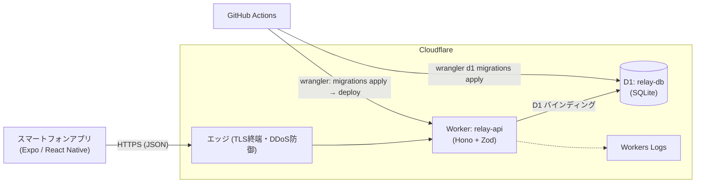

# インフラ設計書（Cloudflare）

対象: NFC版デジタルリレー MVP。アプリ仕様・API・DB設計は [design_overview.md](./design_overview.md) を参照。

> **数値の扱い**: 無料枠・上限値は設計時点の知識に基づく目安で、公式ドキュメントでの再確認は未実施（作業環境から Cloudflare ドキュメントへ接続できなかったため）。実装着手前に「要確認」の項目を公式の Limits / Pricing ページで照合すること。

## 1. 方針

- **サーバー側はCloudflareのみ**で完結させる。使うプロダクトは **Workers（API）** と **D1（データ）** の2つ
- 常時稼働サーバー・VPC・コンテナは持たない。運用対象はWorkerのコードとD1のスキーマだけ
- 環境は `local` / `staging` / `production` の3つ。リソースは環境ごとに完全に分離する
- 手作業のデプロイは避け、GitHub Actionsから`wrangler`で行う。設定はすべてリポジトリ内のコードで管理する（IaC相当）
- MVPでは認証・WAF・冗長構成は作り込まない。ただし後から足せる余地を残す（§10）

## 2. 構成



### 使うプロダクトと使わないもの

| プロダクト | 採否 | 理由 |
|---|---|---|
| Workers | 採用 | APIの実行基盤 |
| D1 | 採用 | チーム・ターンの永続化。UNIQUE制約と条件付きUPDATEで排他制御ができる |
| Workers Static Assets | 将来 | NFC/QRのディープリンク用ファイル配信（§9） |
| Durable Objects | 不採用 | 現状は60秒ポーリングでD1の制約で足りる。WebSocket化するときに再検討 |
| KV / R2 / Queues | 不採用 | 用途がない（結果整合のKVは排他制御に不向き、ファイル・非同期処理がない） |
| Pages | 不採用 | 配信する静的サイトがない（アプリはストア配布） |

## 3. リソース一覧

| リソース | 名前（例） | 環境ごとの分離 |
|---|---|---|
| Worker | `relay-api-staging` / `relay-api-production` | 別Worker |
| D1データベース | `relay-db-staging` / `relay-db-production` | 別DB（データを共有しない） |
| エンドポイント | MVP: `*.workers.dev` / 正式版: 独自ドメイン（例 `api.<domain>`） | 環境ごとに別ホスト名 |
| GitHub Actions用APIトークン | `relay-deploy` | Workers Scripts:Edit + D1:Edit のみ（アカウント/ゾーンを最小化） |

`local`はwranglerのローカルシミュレーション（`wrangler dev`、ローカルD1）を使い、Cloudflare上にリソースを作らない。

## 4. リポジトリ構成とWrangler設定

```
relayyy/
├─ frontend/                 既存のExpoアプリ
├─ backend/
│   ├─ src/
│   │   ├─ index.ts          Honoアプリのエントリ（ルーティング・CORS・エラー処理）
│   │   ├─ routes/           teams.ts / turns.ts / health.ts
│   │   ├─ db/               クエリ関数（SQLはここに集約）
│   │   ├─ lib/              haversine.ts / joinCode.ts / errors.ts
│   │   └─ schemas.ts        Zodスキーマ（docs/api-types.ts と一致させる）
│   ├─ migrations/           0001_init.sql ...（wranglerのマイグレーション）
│   ├─ test/                 vitest（@cloudflare/vitest-pool-workers）
│   ├─ wrangler.jsonc
│   └─ package.json
├─ docs/
└─ .github/workflows/        ci.yml / deploy.yml
```

`backend/wrangler.jsonc` の骨子（IDは作成後に置き換える）:

```jsonc
{
  "name": "relay-api",
  "main": "src/index.ts",
  "compatibility_date": "<実装開始日>",
  "observability": { "enabled": true },
  "vars": { "CORS_ORIGINS": "" },
  "d1_databases": [
    { "binding": "DB", "database_name": "relay-db-local", "database_id": "local", "migrations_dir": "migrations" }
  ],
  "env": {
    "staging": {
      "name": "relay-api-staging",
      "vars": { "CORS_ORIGINS": "" },
      "d1_databases": [
        { "binding": "DB", "database_name": "relay-db-staging", "database_id": "<staging-id>", "migrations_dir": "migrations" }
      ]
    },
    "production": {
      "name": "relay-api-production",
      "vars": { "CORS_ORIGINS": "https://<web版を出す場合のオリジン>" },
      "d1_databases": [
        { "binding": "DB", "database_name": "relay-db-production", "database_id": "<production-id>", "migrations_dir": "migrations" }
      ]
    }
  }
}
```

- 環境ごとに`vars`と`d1_databases`を明示的に定義する（wranglerの環境はバインディングを継承しない）
- シークレットは現時点で不要。将来必要になった場合は`wrangler secret put`で登録し、リポジトリに置かない

## 5. D1運用

### 作成

```bash
wrangler d1 create relay-db-staging --location=apac
wrangler d1 create relay-db-production --location=apac
```

- D1の書き込み先（プライマリ）は1リージョンに固定される。想定ユーザーが日本なので、**作成時にロケーションヒントを`apac`にする**（後から変更できないため作成時に決める）
- Workerはユーザーに近いエッジで動き、DBアクセスだけプライマリへ往復する。日本向けなら往復は数十ms程度に収まる想定
- リードレプリカ（Read Replication）はMVPでは使わない。書き込みが直後の読み取りに反映される一貫性を優先する

### マイグレーション

- `backend/migrations/`に連番SQL（`0001_init.sql`、`0002_...`）を置き、`wrangler d1 migrations apply`で適用する。DDLは design_overview.md §5 を初回マイグレーションとする
- **デプロイ順序は「マイグレーション適用 → Workerデプロイ」**。旧Workerが新スキーマで動くよう、スキーマ変更は後方互換（カラム追加はNULL許容またはDEFAULT付き、削除・リネームは2段階で行う）にする
- D1にはSQLレベルの`BEGIN/COMMIT`をWorkerから発行しない。複数文をアトミックに実行する必要があれば`db.batch([...])`を使う（バッチは1トランザクションとして実行される）。現行のAPIはすべて単一SQL文で完結するため、`batch`は不要

### バックアップ・復旧

- D1のTime Travelで過去の時点へ復元できる（保持期間は無料7日 / 有料30日が目安。**要確認**）
- 復元手順: `wrangler d1 time-travel restore <db> --timestamp=<...>`。破壊的なマイグレーション前には現在のブックマークを控える（`wrangler d1 time-travel info`）
- 定期的なエクスポート（`wrangler d1 export`）はMVPでは行わない。データが失われても致命的でないゲームデータのため

### データ増加への対応

- ゲームに終了条件がなく、`turns`は増え続ける。ただし1ターンは数十バイトなので、1チーム1万ターンでも数百KB規模
- 差分取得（`?since=`）により、ポーリング1回あたりの読み取りは「最新の1〜2行 + チーム存在確認1行」に収まる。履歴が増えても読み取りコストは増えない
- 放置チームの削除（`created_at`と最新`start_at`から判定）は将来課題。MVPでは行わない

## 6. CI/CD

GitHub Actionsで次のワークフローを構成する。

| ワークフロー | トリガー | 内容 |
|---|---|---|
| `ci.yml` | PR / push | `backend`: 型チェック・lint・vitest。`frontend`: `expo lint`・`tsc --noEmit` |
| `deploy.yml`（staging） | `main`へのマージ | ①`d1 migrations apply --env staging --remote` → ②`wrangler deploy --env staging` → ③`/health`のスモークテスト |
| `deploy.yml`（production） | 手動実行（`workflow_dispatch`）またはリリースタグ | stagingと同じ手順を`production`に対して実行。GitHub Environmentsの承認を必須にする |

- `CLOUDFLARE_API_TOKEN` / `CLOUDFLARE_ACCOUNT_ID`はGitHub Environmentsのシークレットとして環境ごとに登録する
- APIトークンは最小権限（対象アカウントのWorkers ScriptsとD1の編集のみ）にする
- テストは`@cloudflare/vitest-pool-workers`でWorkerとローカルD1を実際に動かして行う。優先して自動テスト化する対象は、`receive`の二重実行防止、100m判定の境界、採番の衝突、参加コード重複時の再試行

## 7. セキュリティ

MVPの前提（認証なし・`teamId`が実質的な合言葉）を踏まえ、インフラ側でできる最低限の対策を行う。

| 項目 | 方針 |
|---|---|
| 通信 | HTTPSのみ（Cloudflareが終端。HTTPは自動でリダイレクト） |
| DBアクセス | D1はWorkerのバインディング経由のみ。公開エンドポイントを持たない |
| 認証情報 | アプリに埋め込む秘密情報はなし（APIのベースURLのみ） |
| CORS | 許可オリジンを環境変数`CORS_ORIGINS`で管理。ネイティブアプリ専用の間は空にしてブラウザからのアクセスを許可しない |
| 入力検証 | すべての入力をZodで検証してからSQLに渡す。SQLは必ずプレースホルダ（`bind`）を使い、文字列連結しない |
| エラー応答 | 500では内部情報を返さない。詳細はWorkers Logsにのみ出力する |
| ログの個人情報 | ユーザー名・座標をログに出さない（`teamId`・エンドポイント・ステータスのみ） |
| 総当たり対策 | 参加コード（約8.9億通り）の総当たりはMVPでは許容する。公開後に必要ならCloudflareのRate Limiting（`POST /teams/join`を対象）を追加する |
| 悪用時の対応 | 全体のリクエスト急増に備え、Cloudflareダッシュボードでの一時停止とレート制限ルールの追加を運用手順に含める |

## 8. 可観測性

- `observability.enabled = true`でWorkers Logsを有効にする（リクエスト単位のログと例外を確認できる）
- 1リクエスト1行の構造化ログ（`method` / `path` / `status` / `durationMs` / `errorCode`）をHonoのミドルウェアで出力する
- 監視: `/health`をUptime系の外形監視（無料のもので可）から5分間隔で確認する。アラートはメール通知のみ
- 確認すべき指標: エラー率（5xx）、`CONFLICT`・`ALREADY_RECEIVED`の発生頻度、D1のrows read/written、Workersのリクエスト数（無料枠の消費）

## 9. ドメインとNFC/QRのディープリンク（NFC版を提供する段階）

NFCタグ・QRコードには`https://<サービスのドメイン>/nfc?lat=...&lng=...`を書き込む（design_overview.md §3）。次の準備が必要になる。

- **独自ドメインの取得**とCloudflareへの登録（DNS）。タグに焼き込んだURLは後から変えられないため、**タグを配布する前に確定する**
- API用（`api.<domain>`）とタグ用（`<domain>/nfc`）でホスト名を分けるか同一にするかを決める。タグのURLはAPIの内部構造に依存させないため、`/nfc`はAPIと別のパスとして扱う
- iOSのUniversal Links / AndroidのApp Linksを使い、アプリ導入済みの端末ではタグをかざすとアプリが直接開くようにする。`/.well-known/apple-app-site-association`と`/.well-known/assetlinks.json`をWorkers Static Assetsで配信する
- アプリ未導入端末向けに`/nfc`にランディングページ（ストアへの案内）を置く

これらはNFC提供の段階で実施する。MVPは「アプリ内でNDEFを読み取る」だけなのでドメインは必須ではない（`*.workers.dev`で動かせる）。ただし**タグの書き込みを始める前に独自ドメインを確定**すること。

## 10. コストと上限（目安・要確認）

| 項目 | 無料プラン | 有料プラン（Workers Paid, 月額$5〜） |
|---|---|---|
| Workersリクエスト | 10万回/日 | 1,000万回/月を含む |
| Workers CPU時間 | 1リクエスト約10ms | 大幅に緩和 |
| D1 読み取り行 | 500万行/日 | 250億行/月を含む |
| D1 書き込み行 | 10万行/日 | 5,000万行/月を含む |
| D1 ストレージ | 合計5GB | 大幅に拡大 |

**消費の見積もり**: 1回のポーリングは、Worker 1リクエスト、D1読み取り約3行（チーム存在確認 + 差分ターン1〜2行）。アプリを1日30分フォアグラウンドで使うユーザーは約30リクエスト/日。無料枠の10万リクエスト/日で **約3,000人/日** を賄える計算になる。

- ポーリングで先に尽きるのはWorkersのリクエスト数（D1の行数ではない）。**無料枠超過時は課金されず、リクエストがエラーになる**ため、想定を超える見込みなら有料プラン（月額$5）へ移行する
- Haversineとzod検証のCPU時間は数ms以下の見込みで、無料枠のCPU上限に収まる
- ポーリング間隔の延長（60秒→90秒など）とバックグラウンド時の停止で、リクエスト数を抑えられる

## 11. 将来拡張の余地

| 要件 | 対応案 |
|---|---|
| ポーリング廃止・リアルタイム更新 | チームごとにDurable Objectsを置きWebSocketで配信。参加コードの引き当てはD1に残す |
| 認証の導入 | 端末ごとのトークンを発行してDBに保存し、Honoのミドルウェアで検証 |
| 不正・悪用対策 | Cloudflare Rate Limiting / Turnstile / WAFルール |
| 企業向けNFC管理画面 | 別Worker + D1（または別テーブル）。現状のゲームAPIとは分離する |
| 読み取り負荷の増大 | D1 Read Replication、またはKVでの読み取りキャッシュ（一貫性要件を確認してから） |

## 12. 構築手順（初回セットアップ）

1. Cloudflareアカウントを用意し、`wrangler login`（ローカル）とデプロイ用APIトークンを作成する
2. `wrangler d1 create`でstaging / productionのDBを作成（`--location=apac`）。出力された`database_id`を`wrangler.jsonc`に反映する
3. `backend/`を初期化し、`migrations/0001_init.sql`に design_overview.md §5 のDDLを記述する
4. ローカルで`wrangler d1 migrations apply relay-db-local --local` → `wrangler dev`で動作確認
5. GitHubのEnvironments（staging / production）にシークレットを登録し、`deploy.yml`をstagingへ実行する
6. `/health`のスモークテストが通ることを確認し、外形監視を設定する
7. フロントエンドのAPI接続先を環境変数`EXPO_PUBLIC_API_BASE_URL`で切り替える（開発: ローカルまたはstaging、ストア配布ビルド: production。EASのビルドプロファイルごとに設定する）
8. productionへの初回デプロイは、staging上で一通りのゲームフロー（作成→参加→設置→受け取り→距離表示）を実機で確認してから行う
